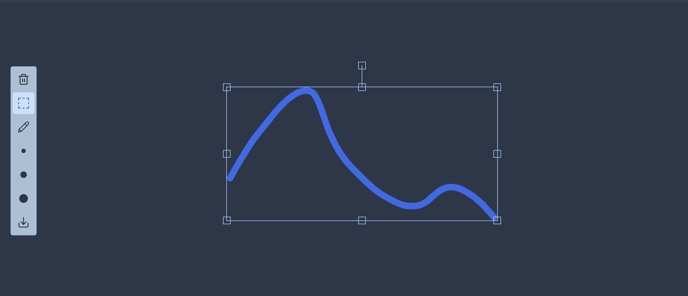

# Draw App Example

В проекте использовалась библиотека Fabric.js для работы с Canvas.



## Установка зависимостей

```
yarn
```

## Запуск локально

```
yarn dev
```

## Сборка

```
yarn build
```
